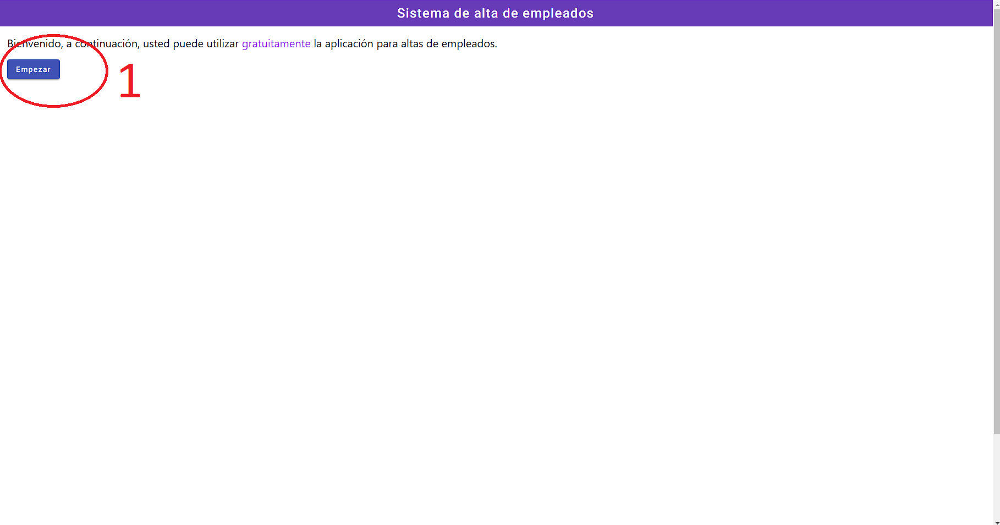
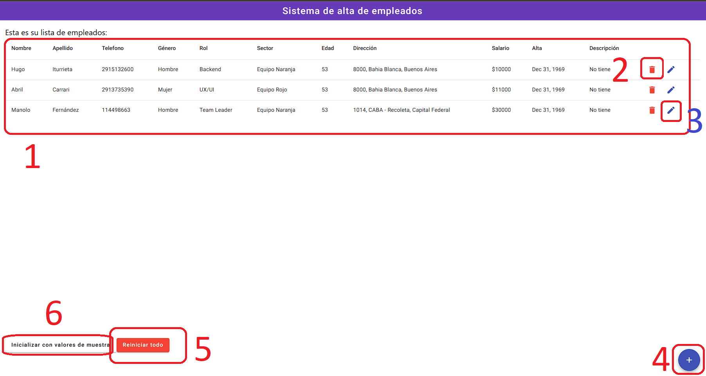
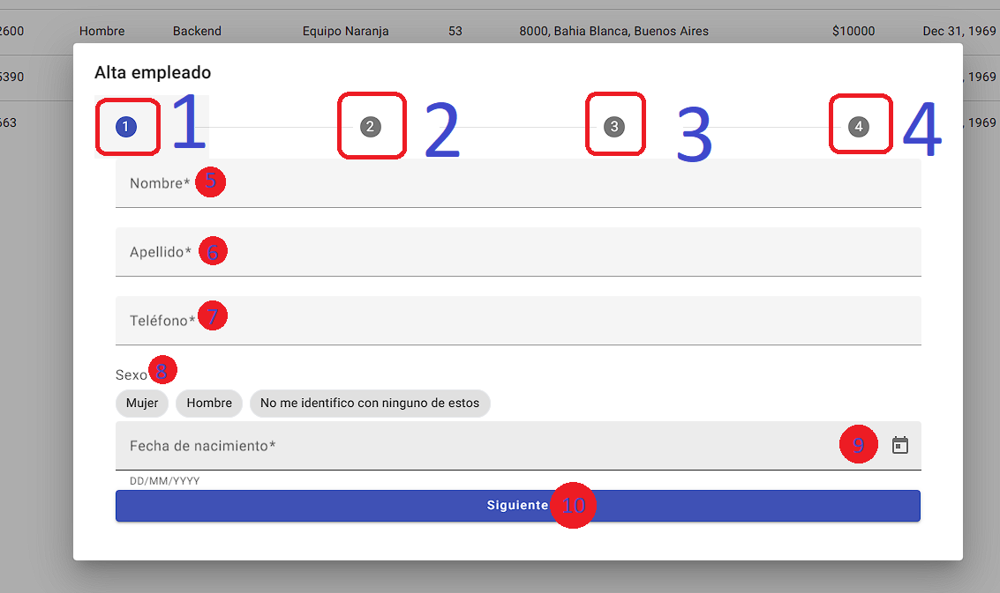
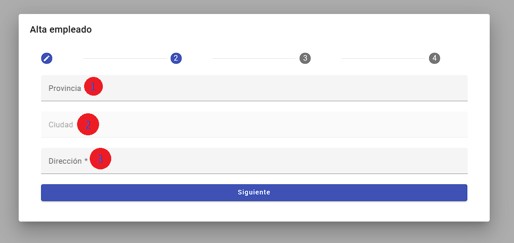
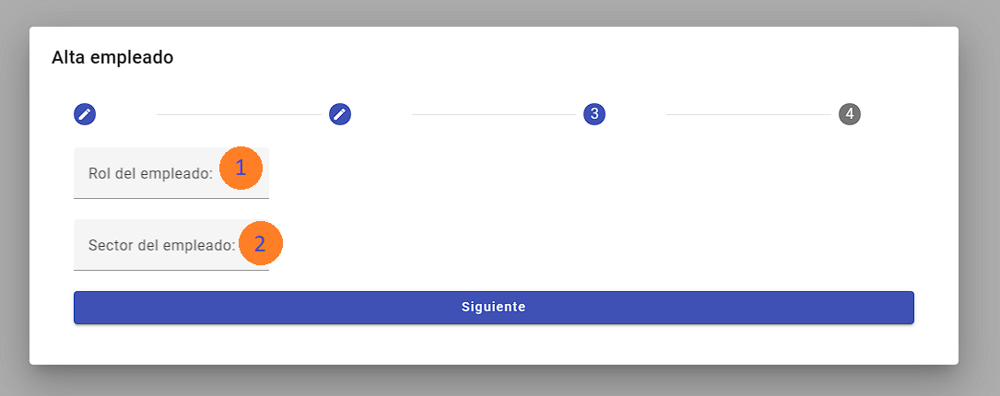
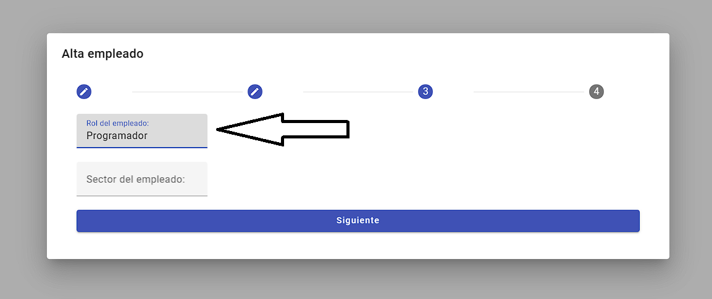
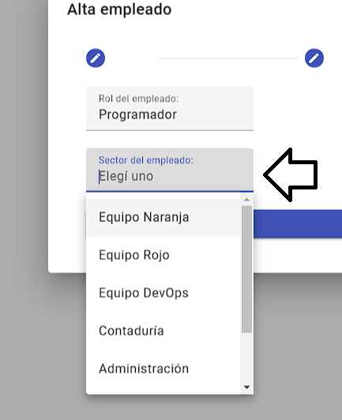
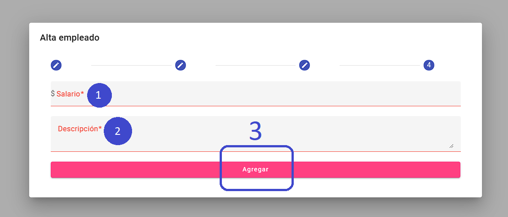
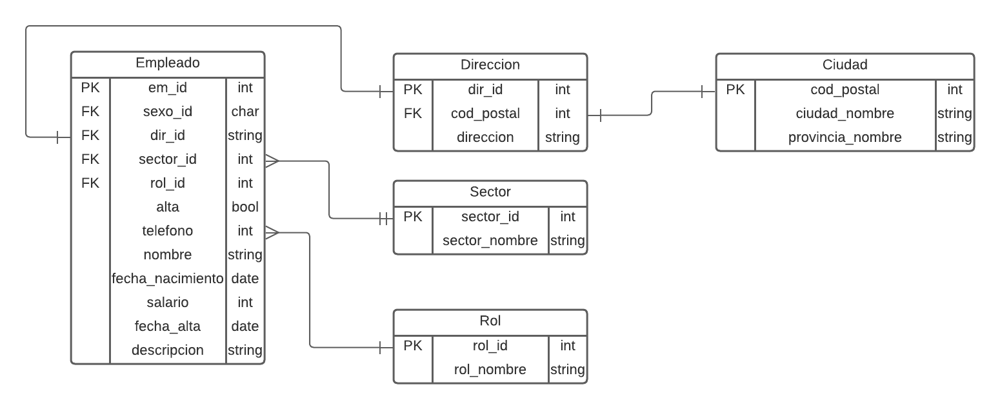

# Sistema de Empleados

## Índice

1. [Descripción](#descripción)
2. [Requisitos](#requisitos)
3. [Instalación](#instalación)
4. [Uso](#uso)
5. [Problemas conocidos y soluciones](#problemas-conocidos-y-soluciones-alternativas)
6. [Probar online](#probar-online)
7. [Testear](#testear)
8. [Documentación backend](#documentación-backend)
9. [Documentación frontend](#documentación-frontend)

## Descripción

Este proyecto consiste en un sistema para gestionar empleados, con una base de datos en Postgres, un backend con node.js y express.js, y un frontend construído con Angular, TailwindCSS y Material Angular.

## Requisitos

- Docker

## Instalación

Clone el proyecto

```bash
  git clone https://github.com/mehLabs/sistemaAltas
```

Para inicializar el sistema, ejecute el siguiente comando en el directorio raíz:

```bash
docker-compose up
```

Una vez que el proceso de instalación esté completo, puede acceder al sistema en `http://localhost:4200`.

## Uso

A continuación se detallan las funciones disponibles en el sistema:

**Agregar Empleados**: Presione el botón "+" que está abajo a la derecha. Rellenar los datos y al finalizar, se agregará el empleado a la lista.

**Eliminar Empleados**: Presione el cesto de basura que está a la derecha de cada empleado en la lista.

**Editar Empleados**: Presione el lápiz que está a la derecha de cada empleado en la lista.

NOTA: Una documentación más detallada se encuentra [aquí](#documentacion-frontend).

## Problemas Conocidos y Soluciones Alternativas

En caso de no funcionar Docker, puede levantar el proyecto con npm utilizando los siguientes comandos:

```bash
npm install
cd frontend && npm install
cd backend && npm install
npm start
```

Nota: Necesita levantar una base de datos PostgreSQL con los siguientes datos:

- Database: "empleados",
- Username: "postgres",
- Password: "12345",
- Puerto: 5432

## Probar online

[Sitio web](https://gotam-238c5.web.app/)

## Testear

El sistema utiliza JEST para el testing unitario de los servicios de cada tabla en la base de datos. Para testear cada requerimiento, posiciónese en /backend/ y ejecute el siguiente comando

```
npm run test:unit
```

## Casos de Uso

El sistema puede ser utilizado por project managers que tienen varios equipos y desean mover la plantilla mientras agregan, modifican y eliminan empleados.

# Documentación Backend

## End-point: Obtener empleados

### Method: GET

> ```
> localhost:8000/api/empleados
> ```

⁃ ⁃ ⁃ ⁃ ⁃ ⁃ ⁃ ⁃ ⁃ ⁃ ⁃ ⁃ ⁃ ⁃ ⁃ ⁃ ⁃ ⁃ ⁃ ⁃ ⁃ ⁃ ⁃ ⁃ ⁃ ⁃ ⁃ ⁃ ⁃ ⁃ ⁃ ⁃ ⁃ ⁃ ⁃ ⁃ ⁃ ⁃ ⁃ ⁃ ⁃ ⁃ ⁃ ⁃ ⁃ ⁃ ⁃

## End-point: Crear empleado

### Method: POST

> ```
> localhost:8000/api/empleados
> ```

### Body (**raw**)

```json
{
    "genero": char,
    "dir_id": number,
    "sector_id": number,
    "rol_id": number,
    "descripcion":string,
    "telefono": number,
    "nombre": string,
    "apellido": string,
    "fecha_nacimiento": number,
    "salario": number,
    "fecha_alta": string | Date,
}
```

⁃ ⁃ ⁃ ⁃ ⁃ ⁃ ⁃ ⁃ ⁃ ⁃ ⁃ ⁃ ⁃ ⁃ ⁃ ⁃ ⁃ ⁃ ⁃ ⁃ ⁃ ⁃ ⁃ ⁃ ⁃ ⁃ ⁃ ⁃ ⁃ ⁃ ⁃ ⁃ ⁃ ⁃ ⁃ ⁃ ⁃ ⁃ ⁃ ⁃ ⁃ ⁃ ⁃ ⁃ ⁃ ⁃ ⁃

## End-point: Editar Empleado

### Method: PUT

> ```
> localhost:8000/api/empleados
> ```

### Body (**raw**)

```json
{
    "id":number,
    "newEmpleado":{
        "genero": char,
        "dir_id": number,
        "sector_id": number,
        "rol_id": number,
        "descripcion":string,
        "telefono": number,
        "nombre": string,
        "apellido": string,
        "fecha_nacimiento": number,
        "salario": number,
        "fecha_alta": string | Date,
    }
}
```

⁃ ⁃ ⁃ ⁃ ⁃ ⁃ ⁃ ⁃ ⁃ ⁃ ⁃ ⁃ ⁃ ⁃ ⁃ ⁃ ⁃ ⁃ ⁃ ⁃ ⁃ ⁃ ⁃ ⁃ ⁃ ⁃ ⁃ ⁃ ⁃ ⁃ ⁃ ⁃ ⁃ ⁃ ⁃ ⁃ ⁃ ⁃ ⁃ ⁃ ⁃ ⁃ ⁃ ⁃ ⁃ ⁃ ⁃

## End-point: Obtener empleado por ID

### Method: GET

> ```
> localhost:8000/api/empleados/id/:id
> ```

⁃ ⁃ ⁃ ⁃ ⁃ ⁃ ⁃ ⁃ ⁃ ⁃ ⁃ ⁃ ⁃ ⁃ ⁃ ⁃ ⁃ ⁃ ⁃ ⁃ ⁃ ⁃ ⁃ ⁃ ⁃ ⁃ ⁃ ⁃ ⁃ ⁃ ⁃ ⁃ ⁃ ⁃ ⁃ ⁃ ⁃ ⁃ ⁃ ⁃ ⁃ ⁃ ⁃ ⁃ ⁃ ⁃ ⁃

## End-point: Dar de baja empleado

### Method: POST

> ```
> localhost:8000/api/empleados/baja
> ```

### Body (**raw**)

```json
{"id":number}
```

⁃ ⁃ ⁃ ⁃ ⁃ ⁃ ⁃ ⁃ ⁃ ⁃ ⁃ ⁃ ⁃ ⁃ ⁃ ⁃ ⁃ ⁃ ⁃ ⁃ ⁃ ⁃ ⁃ ⁃ ⁃ ⁃ ⁃ ⁃ ⁃ ⁃ ⁃ ⁃ ⁃ ⁃ ⁃ ⁃ ⁃ ⁃ ⁃ ⁃ ⁃ ⁃ ⁃ ⁃ ⁃ ⁃ ⁃

## End-point: Resetear base de datos

### Method: DELETE

> ```
> localhost:8000/api/reset
> ```

⁃ ⁃ ⁃ ⁃ ⁃ ⁃ ⁃ ⁃ ⁃ ⁃ ⁃ ⁃ ⁃ ⁃ ⁃ ⁃ ⁃ ⁃ ⁃ ⁃ ⁃ ⁃ ⁃ ⁃ ⁃ ⁃ ⁃ ⁃ ⁃ ⁃ ⁃ ⁃ ⁃ ⁃ ⁃ ⁃ ⁃ ⁃ ⁃ ⁃ ⁃ ⁃ ⁃ ⁃ ⁃ ⁃ ⁃

## End-point: Inicializar Base de datos con ejemplos

### Method: POST

> ```
> localhost:8000/api/init
> ```

⁃ ⁃ ⁃ ⁃ ⁃ ⁃ ⁃ ⁃ ⁃ ⁃ ⁃ ⁃ ⁃ ⁃ ⁃ ⁃ ⁃ ⁃ ⁃ ⁃ ⁃ ⁃ ⁃ ⁃ ⁃ ⁃ ⁃ ⁃ ⁃ ⁃ ⁃ ⁃ ⁃ ⁃ ⁃ ⁃ ⁃ ⁃ ⁃ ⁃ ⁃ ⁃ ⁃ ⁃ ⁃ ⁃ ⁃

## End-point: Obtener ciudades

### Method: GET

> ```
> localhost:8000/api/ciudades
> ```

⁃ ⁃ ⁃ ⁃ ⁃ ⁃ ⁃ ⁃ ⁃ ⁃ ⁃ ⁃ ⁃ ⁃ ⁃ ⁃ ⁃ ⁃ ⁃ ⁃ ⁃ ⁃ ⁃ ⁃ ⁃ ⁃ ⁃ ⁃ ⁃ ⁃ ⁃ ⁃ ⁃ ⁃ ⁃ ⁃ ⁃ ⁃ ⁃ ⁃ ⁃ ⁃ ⁃ ⁃ ⁃ ⁃ ⁃

## End-point: Obtener ciudades por Código Postal

### Method: GET

> ```
> localhost:8000/api/ciudades/postal/:cod_postal
> ```

⁃ ⁃ ⁃ ⁃ ⁃ ⁃ ⁃ ⁃ ⁃ ⁃ ⁃ ⁃ ⁃ ⁃ ⁃ ⁃ ⁃ ⁃ ⁃ ⁃ ⁃ ⁃ ⁃ ⁃ ⁃ ⁃ ⁃ ⁃ ⁃ ⁃ ⁃ ⁃ ⁃ ⁃ ⁃ ⁃ ⁃ ⁃ ⁃ ⁃ ⁃ ⁃ ⁃ ⁃ ⁃ ⁃ ⁃

## End-point: Obtener ciudad por ID

### Method: GET

> ```
> localhost:8000/api/ciudades/id/:id
> ```

⁃ ⁃ ⁃ ⁃ ⁃ ⁃ ⁃ ⁃ ⁃ ⁃ ⁃ ⁃ ⁃ ⁃ ⁃ ⁃ ⁃ ⁃ ⁃ ⁃ ⁃ ⁃ ⁃ ⁃ ⁃ ⁃ ⁃ ⁃ ⁃ ⁃ ⁃ ⁃ ⁃ ⁃ ⁃ ⁃ ⁃ ⁃ ⁃ ⁃ ⁃ ⁃ ⁃ ⁃ ⁃ ⁃ ⁃

## End-point: Obtener ciudad por provincia

### Method: GET

> ```
> localhost:8000/api/ciudades/provincia/:provincia
> ```

⁃ ⁃ ⁃ ⁃ ⁃ ⁃ ⁃ ⁃ ⁃ ⁃ ⁃ ⁃ ⁃ ⁃ ⁃ ⁃ ⁃ ⁃ ⁃ ⁃ ⁃ ⁃ ⁃ ⁃ ⁃ ⁃ ⁃ ⁃ ⁃ ⁃ ⁃ ⁃ ⁃ ⁃ ⁃ ⁃ ⁃ ⁃ ⁃ ⁃ ⁃ ⁃ ⁃ ⁃ ⁃ ⁃ ⁃

## End-point: Obtener provincias

### Method: GET

> ```
> localhost:8000/api/ciudades/provincias
> ```

⁃ ⁃ ⁃ ⁃ ⁃ ⁃ ⁃ ⁃ ⁃ ⁃ ⁃ ⁃ ⁃ ⁃ ⁃ ⁃ ⁃ ⁃ ⁃ ⁃ ⁃ ⁃ ⁃ ⁃ ⁃ ⁃ ⁃ ⁃ ⁃ ⁃ ⁃ ⁃ ⁃ ⁃ ⁃ ⁃ ⁃ ⁃ ⁃ ⁃ ⁃ ⁃ ⁃ ⁃ ⁃ ⁃ ⁃

## End-point: Obtener direcciones

### Method: GET

> ```
> localhost:8000/api/direcciones
> ```

⁃ ⁃ ⁃ ⁃ ⁃ ⁃ ⁃ ⁃ ⁃ ⁃ ⁃ ⁃ ⁃ ⁃ ⁃ ⁃ ⁃ ⁃ ⁃ ⁃ ⁃ ⁃ ⁃ ⁃ ⁃ ⁃ ⁃ ⁃ ⁃ ⁃ ⁃ ⁃ ⁃ ⁃ ⁃ ⁃ ⁃ ⁃ ⁃ ⁃ ⁃ ⁃ ⁃ ⁃ ⁃ ⁃ ⁃

## End-point: Obtener roles

### Method: GET

> ```
> localhost:8000/api/roles
> ```

⁃ ⁃ ⁃ ⁃ ⁃ ⁃ ⁃ ⁃ ⁃ ⁃ ⁃ ⁃ ⁃ ⁃ ⁃ ⁃ ⁃ ⁃ ⁃ ⁃ ⁃ ⁃ ⁃ ⁃ ⁃ ⁃ ⁃ ⁃ ⁃ ⁃ ⁃ ⁃ ⁃ ⁃ ⁃ ⁃ ⁃ ⁃ ⁃ ⁃ ⁃ ⁃ ⁃ ⁃ ⁃ ⁃ ⁃

## End-point: Obtener sectores

### Method: GET

> ```
> localhost:8000/api/sectores
> ```

⁃ ⁃ ⁃ ⁃ ⁃ ⁃ ⁃ ⁃ ⁃ ⁃ ⁃ ⁃ ⁃ ⁃ ⁃ ⁃ ⁃ ⁃ ⁃ ⁃ ⁃ ⁃ ⁃ ⁃ ⁃ ⁃ ⁃ ⁃ ⁃ ⁃ ⁃ ⁃ ⁃ ⁃ ⁃ ⁃ ⁃ ⁃ ⁃ ⁃ ⁃ ⁃ ⁃ ⁃ ⁃ ⁃ ⁃

## End-point: Crear dirección

### Method: POST

> ```
> localhost:8000/api/direcciones
> ```

### Body (**raw**)

```json
{
    "cod_postal":number,
    "id_ciudad":number,
    "direccion":string
}
```

⁃ ⁃ ⁃ ⁃ ⁃ ⁃ ⁃ ⁃ ⁃ ⁃ ⁃ ⁃ ⁃ ⁃ ⁃ ⁃ ⁃ ⁃ ⁃ ⁃ ⁃ ⁃ ⁃ ⁃ ⁃ ⁃ ⁃ ⁃ ⁃ ⁃ ⁃ ⁃ ⁃ ⁃ ⁃ ⁃ ⁃ ⁃ ⁃ ⁃ ⁃ ⁃ ⁃ ⁃ ⁃ ⁃ ⁃

## End-point: Crear sector

### Method: POST

> ```
> localhost:8000/api/sectores
> ```

### Body (**raw**)

```json
{
    "sector_nombre":string
}
```

⁃ ⁃ ⁃ ⁃ ⁃ ⁃ ⁃ ⁃ ⁃ ⁃ ⁃ ⁃ ⁃ ⁃ ⁃ ⁃ ⁃ ⁃ ⁃ ⁃ ⁃ ⁃ ⁃ ⁃ ⁃ ⁃ ⁃ ⁃ ⁃ ⁃ ⁃ ⁃ ⁃ ⁃ ⁃ ⁃ ⁃ ⁃ ⁃ ⁃ ⁃ ⁃ ⁃ ⁃ ⁃ ⁃ ⁃

## End-point: Crear rol

### Method: POST

> ```
> localhost:8000/api/roles
> ```

### Body (**raw**)

```json
{
    "rol_nombre":string
}
```

⁃ ⁃ ⁃ ⁃ ⁃ ⁃ ⁃ ⁃ ⁃ ⁃ ⁃ ⁃ ⁃ ⁃ ⁃ ⁃ ⁃ ⁃ ⁃ ⁃ ⁃ ⁃ ⁃ ⁃ ⁃ ⁃ ⁃ ⁃ ⁃ ⁃ ⁃ ⁃ ⁃ ⁃ ⁃ ⁃ ⁃ ⁃ ⁃ ⁃ ⁃ ⁃ ⁃ ⁃ ⁃ ⁃ ⁃

## End-point: Eliminar dirección

### Method: POST

> ```
> localhost:8000/api/direcciones/eliminar
> ```

### Body (**raw**)

```json
{
    "id":number
}
```

⁃ ⁃ ⁃ ⁃ ⁃ ⁃ ⁃ ⁃ ⁃ ⁃ ⁃ ⁃ ⁃ ⁃ ⁃ ⁃ ⁃ ⁃ ⁃ ⁃ ⁃ ⁃ ⁃ ⁃ ⁃ ⁃ ⁃ ⁃ ⁃ ⁃ ⁃ ⁃ ⁃ ⁃ ⁃ ⁃ ⁃ ⁃ ⁃ ⁃ ⁃ ⁃ ⁃ ⁃ ⁃ ⁃ ⁃

## End-point: Eliminar sectores

### Method: POST

> ```
> localhost:8000/api/sectores/eliminar
> ```

### Body (**raw**)

```json
{
    "id":number
}
```

⁃ ⁃ ⁃ ⁃ ⁃ ⁃ ⁃ ⁃ ⁃ ⁃ ⁃ ⁃ ⁃ ⁃ ⁃ ⁃ ⁃ ⁃ ⁃ ⁃ ⁃ ⁃ ⁃ ⁃ ⁃ ⁃ ⁃ ⁃ ⁃ ⁃ ⁃ ⁃ ⁃ ⁃ ⁃ ⁃ ⁃ ⁃ ⁃ ⁃ ⁃ ⁃ ⁃ ⁃ ⁃ ⁃ ⁃

## End-point: Eliminar rol

### Method: POST

> ```
> localhost:8000/api/roles/eliminar
> ```

### Body (**raw**)

```json
{
    "id":number
}
```

⁃ ⁃ ⁃ ⁃ ⁃ ⁃ ⁃ ⁃ ⁃ ⁃ ⁃ ⁃ ⁃ ⁃ ⁃ ⁃ ⁃ ⁃ ⁃ ⁃ ⁃ ⁃ ⁃ ⁃ ⁃ ⁃ ⁃ ⁃ ⁃ ⁃ ⁃ ⁃ ⁃ ⁃ ⁃ ⁃ ⁃ ⁃ ⁃ ⁃ ⁃ ⁃ ⁃ ⁃ ⁃ ⁃ ⁃

# Documentación Frontend

## Vistas:

### Bienvenida



- 1- Para empezar a usar el sistema, presione el botón "Empezar".

### Grilla de empleados



- 1- Esta es la lista de empleados ya dados de alta, con sus respectivas columnas.
- 2- Botón eliminar: Al presionarlo, se elimina la fila con su empleado. Nota: el empleado no se elimina de la base de datos, sólo cambia de estado a "dado de baja", en futuras versiones se podrán ver todos los empleados dados de baja.
- 3- Botón editar: Al presionarlo, se abre una pantalla interactiva para editar los campos de este empleado.
- 4- Botón agregar empleado: Al presionarlo, se abre una pantalla interactiva con todos los campos vacíos para agregar un nuevo empleado a la lista.
- 5- Botón reiniciar todo: Al presionarlo, se reinicia la base de datos, eliminando todos datos, incluídos los empleados y su información de contacto. ADVERTENCIA: Esta acción no es reversible.
- 6- Botón para inicializar: Este botón reinicia la base de datos (destructivo) y agrega valores de ejemplo, para probar el sistema.

### Alta de empleado - Parte 1



- 1- Paso 1: Datos básicos (Usted está aquí).
- 2- Paso 2: Ubicación.
- 3- Paso 3: Asignar rol y sector.
- 4- Paso 4: Salario y descripción adicional.
- 5- Nombre.
- 6- Apellido.
- 7- Teléfono.
- 8- Sexo: presione uno de los chips.
- 9- Puede escribir una fecha en el formato dd/mm/aaaa o usar el calendario interactivo mediante el botón que se encuentra a la derecha del campo.
- 10- Botón siguiente: Asegúrese de completar todos los campos antes de continuar, o al final del formulario se le impedirá agregar al empleado.

### Alta de empleado - Parte 2



- 1- Provincia: Seleccione una de las 23 provincias. Nota: Sólo podrá seleccionar una de esas.
- 2- Ciudad: Este campo sólo se activa al seleccionar una de las 23 provincias válidas. Una vez activo, ingrese 3 letras de la ciudad deseada y visualizará una lista con las ciudades de esa provincia que coincidan con el texto ingresado. NOTA: CP es código postal.
- 3- Dirección: Asegurese de introducir el valor indicado, ya que el sistema no anailizará la veracidad de este dato.

### Alta de empleado - Parte 3



- 1- Rol: Ingrese el rol del empleado, ya sea programador o no programador.



Nota: En caso de no existir rol/sector, se creará uno.



Nota: En caso de sí existir el sector/rol, se desplegará una lista con los sectores/roles más similares.

### Alta de empleado - Parte 4



- 1- Salario: Sólo acepta números sin decimales.
- 2- Descripción: En caso de no ingresar ninguna, el valor por defecto es "no tiene" (descripción).
- 3- Si todos los campos fueron llenados correctamente, el empleado se agregará al sistema instantáneamente.

# Base de datos

## Descripción de la base de datos:

A fin de almacenar cada empleado registrado en el sistema, se utilizará una base de datos relacional (POSTGRESQL), con un ORM para ahorrar tiempo (Sequelize).

La base de datos contiene las siguientes tablas y campos:

1. Empleado
* em_id (PK)
* nombre
* apellido
* genero
* alta
* dir_id (FK)
* sector_id (FK)
* rol_id (FK)
* telefono
* fecha_nacimiento
* salario
* fecha_alta
* descripcion
2. Direccion
* dir_id (PK)
* cod_postal
* id_ciudad (FK)
3. Ciudad
* id_ciudad (PK)
* cod_postal
* ciudad_nombre
* provincia_nombre
4. Sector
* sector_id (PK)
* sector_nombre
5. Rol
* rol_id (PK)
* rol_nombre

Empleado tiene una relación ManyToOne con Dirección, Sector y Rol. Ya que un empleado puede tener sólo una dirección, un sector y un rol, pero un sector puede ser compartido con muchos empleados y lo mismo el rol, incluso la dirección.

Dirección tiene una relación ManyToOne con Ciudad, ya que una ciudad contiene muchas direcciones, pero una dirección debe pertenecer sólo a una ciudad.

La base de datos inicializa la tabla ciudades a partir de un archivo .xlsx, que demora un poco debido a la gran cantidad de ciudades que existen en Argentina. Cabe mencionar que no hay problemas de performance luego de inicializar la tabla.

## DER



# Estimación de tiempo

1. Diseño
* Arquitectura (30 mins)
* DER (45 mins)
* Frontend (45 mins)
* Tests (2 horas)

2. Desarrollo
* Base de datos (1 hora)
* Backend (2,5 horas)
  * Inicializar(2 horas)
  * CRUD (30 mins)
* Frontend (6,5 horas)
  * UI (2,5 horas)
  * Servicios (4 horas)

3. Testing
* Aprender (4 horas)
* Pruebas unitarias backend (3 horas)

4. Documentación
* Dependencias (1 hora)
* Aprender Docker (2 horas)
* Preparar entorno docker-compose (3 horas)
* Endpoints (1 hora)
* Instrucciones para levantar el proyecto (2 horas)
* Base de datos (1 hora)

### Total = 31 horas.

## Reporte de mi uso del tiempo:
* Días efectivos trabajados: 15
* Promedio de tiempo diario: 2 horas, 52 minutos, 20 segundos.
* Tiempo total trabajado: 43 horas, 12 minutos.
* Método de conteo de tiempo:
  * [Excel con tarjetas](./docs/tiempo.xlsx) 

